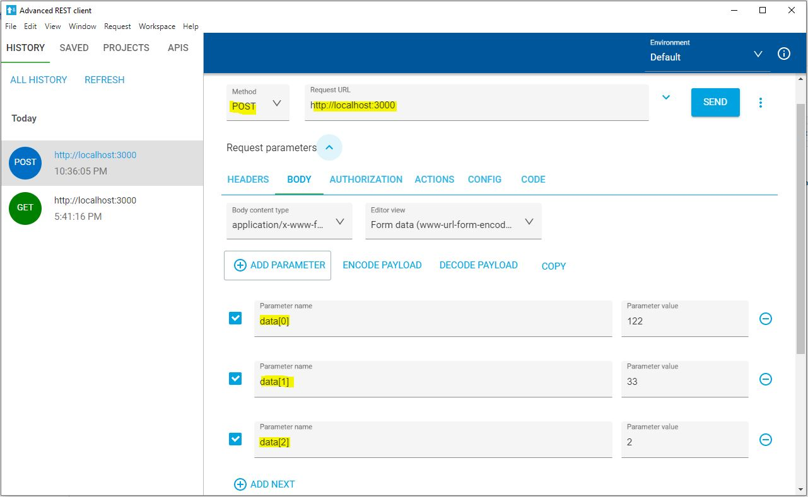

# Create Microservices Architecture Using Nest.js

[Nest.js](https://docs.nestjs.com/) is awsome, it's support developing a vast kind of architectures, this example contains a hybrid application where services talking each other using HTTP and TCP. 
<br />

This application contains two parts: 
1. <b>main.app</b> the main proccess - the entry point, where you can navigate and execute the services behind, and;
2. <b>math.service</b> the microservice that running in the background. 

## Installation
After cloning/downloading the code, get into each folder and run 
```bash
$ npm install
```

## Running the app
In order to run get into each folder and run
```bash
# development
$ npm run start

# watch mode
$ npm run start:dev

# debug mode
$ npm run start:debug
```
## Testing the app

NOTE: the server running on port 3000 and the service on the port of 3001 therfore, both port's should be available before running the app. 
