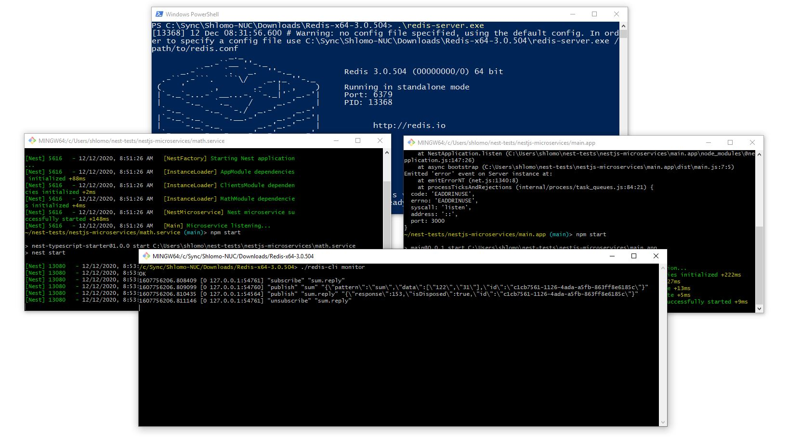

# Create Microservices Using Nest.js

[Nest.js](https://docs.nestjs.com/) is awsome! especially if you're Angular developer, because it's use Typescript, it's look-and-feel very similar and it's also lends many features such as: dependency injection mechansim, it's use decorators like @Module @Injectable and etc.
<br /><br />
[Nest.js](https://docs.nestjs.com/) is supporting a vast kind of architectures for developing, and so on... this example contains a hybrid application where services talking each other using HTTP and TCP.
<br />

### In this example I use two microservice metodologies:
TCP - where service connecting each other directly through TCP:

<br />

Redis - where service connecting each other through message broker (Redis):


This application contains two parts: 
1. <b>main.app</b> the main proccess - the entry point, where you can navigate and execute the services behind, and;
2. <b>math.service</b> the microservice that running in the background. 

### Installation:
After cloning/downloading the code, get into each folder and run 
```bash
$ npm install
```

### Running the app:
In order to run get into each folder and run
```bash
# development
$ npm run start

# watch mode
$ npm run start:dev

# debug mode
$ npm run start:debug
```

<br />
### Testing the app:

NOTE: the server running on port 3000 and the service on the port of 3001 therfore, both port's should be available before running the app. 
<br />

### Running the app using Redis as message broker:
In order to run the example you need first download redis, change the microservice configuration to:
```javascript
{
  transport: Transport.REDIS,
  options: {
    url: 'redis://localhost:6379'
  }
}
```

Install redis dependencies for each service/apps, get into each folder and run
```npm
$ npm install redis
```

### Testing the app with Redis:


NOTE: In order to see the messages going through redis, you should monitor it by command:
```bash
$ ./redis-cli monitor
 ```
